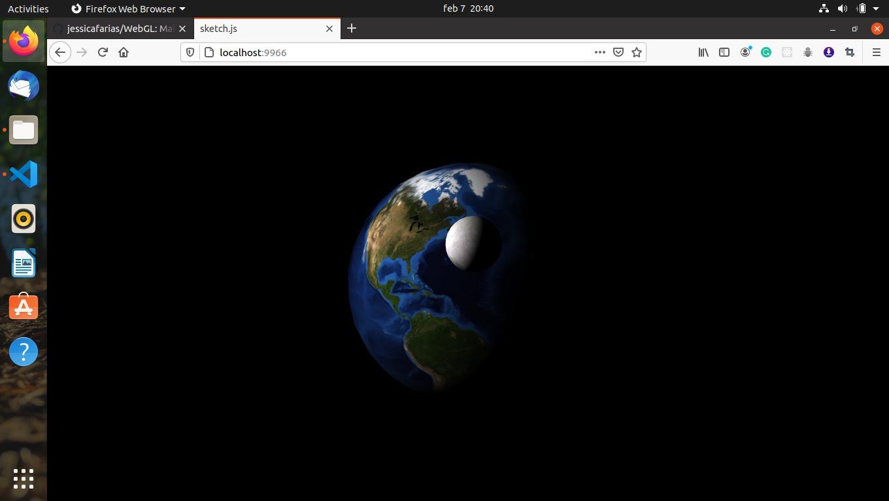

# WebGL
Making a fantastic and interactive Front-End Website usign WebGL and GLSL

[![Contributors][contributors-shield]][contributors-url]
[![Forks][forks-shield]][forks-url]
[![Stargazers][stars-shield]][stars-url]
[![Issues][issues-shield]][issues-url]

## WebWorld
<p align="center">
<a align="center" href="https://github.com/jessicafarias/WebGL">
    
  </a>
</p>

## Live Version
 [Click here!](https://www.linkedin.com/in/jessica-michelle-farias-rosado/)

### Clone
* Clone this repo:
  - Clone with SSH:
  ```
    git@github.com:jessicafarias/WebGL.git
  ```
  - Clone with HTTPS
  ```
    https://github.com/jessicafarias/WebGL.git
  ```
  - Clone with GitHub CLI
  ```
    gh repo clone jessicafarias/WebGL
    
 - cd to WebGL


## Run in local server:

```sh
npm install
```

## Getting started: go to the terminal and write
```sh
canvas-sketch src/sketch.js
```

Now you can se de website in port 9966
http://localhost:9966/


## Bundling to a Website

If you'd like to publish your artwork or interactive piece onto the web, here's how you can do it.

First, you have to bundle your sketch as a static website.

You can do this with the `--build` flag:

```sh
canvas-sketch sketch.js --build --name=index
```

## 👤 Jessica Michelle Farías Rosado:
 [](https://jessicafarias.github.io/)
 [](https://www.linkedin.com/in/jessica-michelle-farias-rosado/)
 [](mailto:jessica.farias.rosado@gmail.com)
 [](https://twitter.com/FariasRosado)


## 🤝 Contributing

Contributions, issues and feature requests are welcome!

Feel free to check the [issues page](https://github.com/jessicafarias/WebGL/issues).

## Show your support

Give a :star: if you like this project!

[contributors-shield]: https://img.shields.io/github/contributors/jessicafarias/WebGL.svg?style=flat-square
[contributors-url]: https://github.com/jessicafarias/WebGL/graphs/contributors
[forks-shield]: https://img.shields.io/github/forks/jessicafarias/WebGL.svg?style=flat-square
[forks-url]: https://github.com/jessicafarias/WebGL/network/members
[stars-shield]: https://img.shields.io/github/stars/jessicafarias/WebGL.svg?style=flat-square
[stars-url]: https://github.com/jessicafarias/WebGL/stargazers
[issues-shield]: https://img.shields.io/github/issues/jessicafarias/WebGL.svg?style=flat-square
[issues-url]: https://github.com/jessicafarias/WebGL/issues

## 📝 License

This project is [MIT](https://opensource.org/licenses/MIT) licensed.